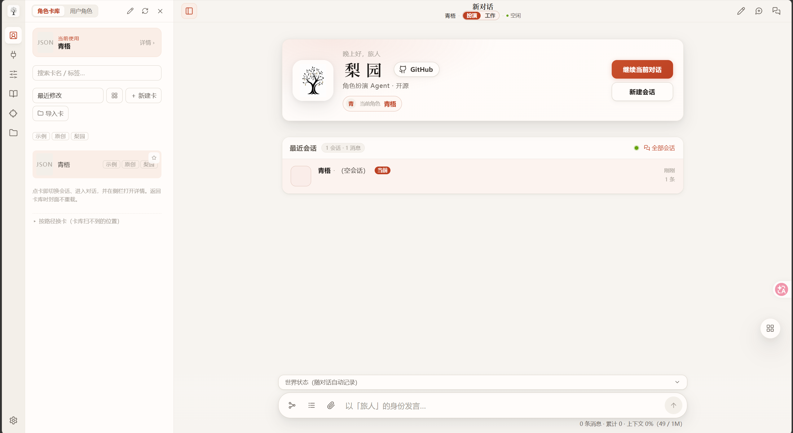
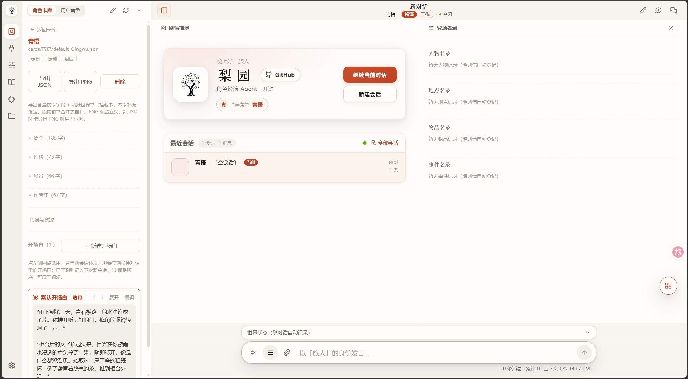
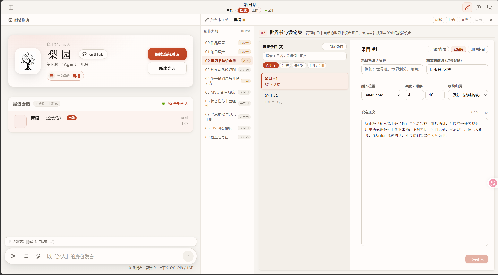

# 梨园 Liyuan

**基于 pi 构建的 RP Agent**  
Liyuan is an RP Agent built on pi, designed to bring coding agent capabilities into role-playing.

📖 **[使用文档](https://docs.liyuan.pro)** · 🚀 **[下载发布版](https://github.com/weidu12123/Liyuan/releases)**



---

## 梨园是什么

梨园是基于 pi 构建的 RP Agent，将 coding agent 的诸多能力 RP 化。目标是以 agent 架构解决传统 rp 项目的诸多问题，为用户带来更好的角色扮演体验。

---

## 梨园的 RP 化

梨园的整个创作思路可以被概括为 agent 的 RP 化，通过类比 coding agent 的诸多能力并将其 RP 化。

| Coding Agent | 梨园 RP 化 |
|---|---|
| 项目文件夹（Workspace / cwd） | 角色卡独立空间（一卡一目录） |
| 代码 | 剧情正文 |
| 代码局部修改（Edit / Patch） | 局部定点改稿 |
| 代码匹配工具（Grep / Search） | 文本匹配工具 |
| 代码版本回退（Rewind / Checkpoint） | 稿件回滚与上一拍修订 |
| 上下文压缩（Compact） | 剧情向压缩（前情提要） |
| 跨会话记忆（Codex Memories） | 卡级记忆（复盘、合并与遗忘） |
| 关键操作确认（Permission Gate） | 剧情分岔决策卡 |
| 规则分层（SYSTEM.md / AGENTS.md） | 引擎协议与卡片世界法则 |

---

## 核心能力

### 1. 记忆能力
- **纯净上下文与剧情压缩**：harness 确定性过滤过程数据，长篇对话按叙事逻辑汇总为前情提要。
- **即时状态与登场名录**：旁路自动记账时间、地点、物品与人物在场状态，每拍锚定防止设定漂移。
- **设定集按需检索**：世界书与知识库不占常驻窗口，模型在需要时主动按需检索设定原文。
- **卡级跨会话记忆与遗忘**：局复盘自动合并沉淀为卡级记忆，删除对话同步触发事实的物理遗忘。



### 2. 高度自定义
- **提示词分层自定义**：开放 `SYSTEM.md`（引擎底层协议）与 `AGENTS.md`（角色世界法则），支持完全透明的文件化编辑与条目级开关。
- **角色卡协同制作平台**：内置角色卡工坊与工作模式，支持用户与 Agent 在沙箱内协同编写、修改与测试卡片资源与前端脚本。



### 3. 数据迁移性
- **卡空间物理独立迁移**：每张卡作为一个完整工作空间，会话、状态与记忆物理聚合，单卡目录支持跨设备直接拷贝即用。
- **通用数据资产导入导出**：支持标准角色卡、世界书与历史会话直接导入续玩，知识资产可自由导出为通用格式，无数据锁定。
- **纯透明本地文件存储**：全量数据以明文 JSON 与 Markdown 落地，不依赖数据库黑盒，支持随时归档、备份与手动管理。

### 4. 用户沉浸感
- **关键岔口停笔共创**：关键剧情转折处主动调用 ask 工具征询，提供分支选项与自由输入，由用户决定故事走向。
- **正文意图化修改与替换**：支持直接输入修改建议让 Agent 定向调整或替换最新正文，告别推翻整篇重新生成。

---

## 快速开始

> 完整图文上手与界面详解请参阅 **[梨园使用文档 (docs.liyuan.pro)](https://docs.liyuan.pro)**。

### 环境要求
- **Node.js ≥ 22**
- 任一 OpenAI 兼容格式 API Key（如 DeepSeek 等）

### 本地运行

```bash
# 生成本地配置文件
cp liyuan.agent.example.json liyuan.agent.json
cp liyuan.config.example.json liyuan.config.json

# 编辑 liyuan.agent.json 填入 apiKey 与模型 ID

# 安装依赖并启动
npm install
npm run web:build    # 编译前端（已有 web/dist 可跳过）
npm run web          # 启动服务
```

- **Windows**：双击 `start.bat`
- **Linux / macOS**：执行 `chmod +x start.sh && ./start.sh`
- 浏览器访问 `http://127.0.0.1:7620`

> 7620 端口服务默认无鉴权，请勿直接裸暴露至公网。公网访问请配置反向代理与身份验证。

---

## 部署

### Docker 运行

```bash
git clone --depth 1 https://github.com/weidu12123/Liyuan.git && cd Liyuan
docker compose up -d --build
```
数据与配置持久化保存于本地映射卷中。

---

## 开发者

```
领域层  src/                        角色卡、设定集、场记、记忆、世界线等业务逻辑
接线层  .liyuan/extensions/roleplay.ts   pi 钩子与工具注册挂载
Web 层  server/ + web/             服务端调度、WebSocket/REST 协议与前端页面
内核层  packages/@liyuan/*         本地维护的 pi agent 核心库
```

单元测试执行：
```bash
node --test test/*.test.ts
```

---

## 许可证

- 主项目采用 **[PolyForm Noncommercial 1.0.0](LICENSE)** 许可：个人与非商业用途可自由使用、修改与分发。任何商业用途需单独联系作者取得授权。
- 内核代码基于 [pi](https://github.com/earendil-works/pi)（MIT 协议）二次开发，完整保留其原版权声明与许可。

---

## 友链

[linux.do](https://linux.do)
